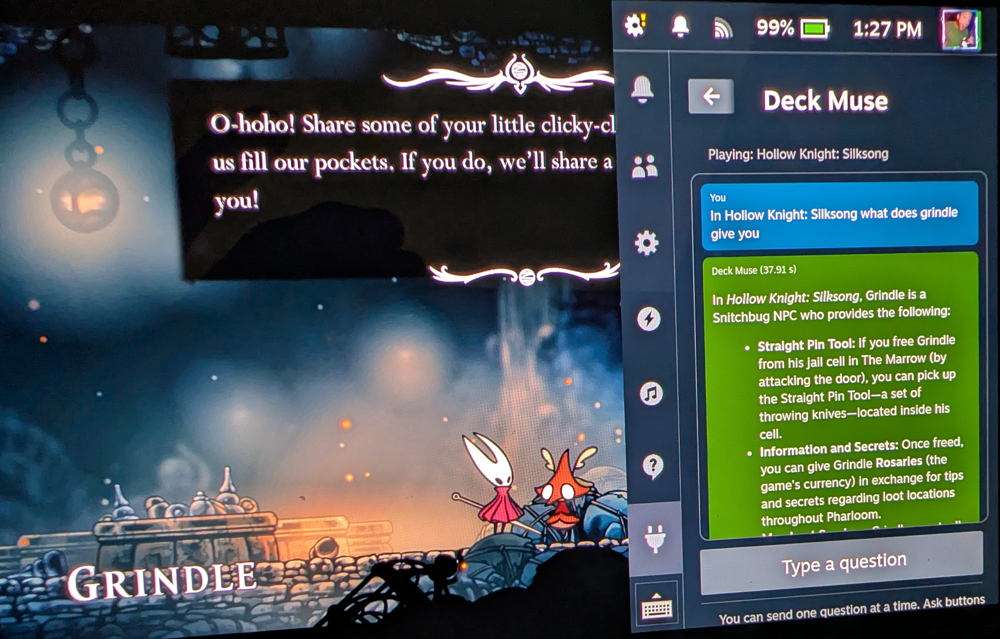

# Decky AI

Steam Deck과 SteamOS 기반 UMPC의 Decky Loader에서 실행되는 Gemini 게임 도우미 플러그인입니다. 게임을 종료하거나 데스크톱으로 전환하지 않고 빠른 메뉴에서 질문, 음성 입력, 현재 게임 화면 분석, YouTube 공략 검색을 사용할 수 있습니다.



> 이 프로젝트는 BSD-3-Clause 라이선스의 [gloverthe/deck-muse](https://github.com/gloverthe/deck-muse)를 기반으로 제작되었습니다. 원본 프로젝트와 기여자에게 감사드립니다.

## 주요 기능

- 현재 실행 중인 Steam 게임 이름 자동 인식
- Gemini 3.5 Flash 기반 일반 대화, 번역, 게임 질문, 이미지 분석
- Gemini 2.5 Flash + Google Search 기반 실시간 웹 검색
- 날씨·뉴스·환율·주가 등 실시간 질문 자동 감지
- 직접 선택할 수 있는 `3.5 Flash` / `2.5 Flash` / `Google 검색` 모드
- 화면 키보드와 로컬 Whisper 음성 타이핑 버튼을 함께 제공하는 질문 입력창
- 현재 게임 용어를 힌트로 사용해 입력란에 텍스트만 추가하는 한국어 음성 타이핑(API 사용 없음)
- 현재 화면 캡처와 게임 이름을 결합한 YouTube 공략 검색
- Decky AI 안에서 YouTube 영상 재생 및 외부 브라우저 열기
- 영상의 공식 챕터 표시
- 공식 챕터가 없을 때 자막을 이용한 AI 타임테이블 생성
- 패널이 닫히면 화면 캡처·녹음·AI 타임테이블 작업 중단
- 백그라운드 폴링 없이 필요할 때만 API와 캡처 기능 실행

## Gemini 모델은 어떻게 선택되나요?

Decky AI는 모든 작업에 같은 모델을 사용하지 않습니다. 성능, 무료 검색 가능 여부, API 사용량을 고려해 작업별로 모델을 선택합니다.

### Gemini 3.5 Flash — 일반 질문과 화면 분석

기본 모델 ID는 `gemini-3.5-flash`입니다.

다음 작업에 사용합니다.

- 일반 대화
- 번역과 문장 설명
- 게임 빌드 및 스킬트리 추천
- 긴 대화의 문맥 이해
- 캡처한 게임 화면에서 장소·퍼즐·임무·보스 식별
- 자막을 바탕으로 YouTube AI 타임테이블 생성

3.5 Flash는 2.5 Flash보다 최신이며 복잡한 추론과 멀티모달 화면 분석에 유리합니다. 하지만 Gemini API 무료 등급에서는 3.x 모델의 Google Search grounding을 사용할 수 없으므로, 실시간 정보가 필요한 질문에는 기본적으로 2.5 Flash 검색을 사용합니다.

### Gemini 2.5 Flash — Google 실시간 검색

검색 모델 ID는 `gemini-2.5-flash`입니다.

다음 질문에 사용합니다.

- 오늘 날씨와 현재 기온
- 최신 뉴스
- 환율·주가·실시간 가격
- 최신 게임 패치와 현재 메타
- 사용자가 `2.5 Flash` 모드를 직접 선택한 질문

무료 Gemini API에서 2.5 Flash는 제한된 횟수 안에서 Google Search grounding을 사용할 수 있습니다. Decky AI는 응답에 grounding 메타데이터가 실제로 포함됐는지 검사합니다. 검색이 성공하면 답변 아래에 `실제 Google 검색 확인됨`과 출처 링크가 표시됩니다. 검색 도구가 실행되지 않은 답변을 실시간 검색 결과처럼 표시하지 않습니다.

주의: Google 공식 일정에 따르면 `gemini-2.5-flash`는 **2026년 10월 16일 종료 예정**이며 권장 후속 모델은 `gemini-3.5-flash`입니다. 다만 현재 무료 등급에서는 3.5 Flash 검색 grounding을 사용할 수 없으므로, Google의 무료 검색 정책 또는 후속 모델이 변경되면 Decky AI의 검색 모델도 교체해야 합니다.

공식 문서:

- [Gemini 모델 목록](https://ai.google.dev/gemini-api/docs/models)
- [Gemini API 요금과 검색 한도](https://ai.google.dev/gemini-api/docs/pricing)
- [Gemini 모델 종료 일정](https://ai.google.dev/gemini-api/docs/deprecations)

### 3.5 Flash 모드

Gemini 3.5 Flash를 정확히 선택하며 Google Search 도구는 사용하지 않습니다. 일반 대화, 번역, 게임 조언과 복잡한 추론에 적합합니다.

예시:

| 질문 | 선택되는 처리 방식 |
|---|---|
| `이 문장을 한국어로 번역해 줘` | 3.5 Flash 일반 대화 |
| `고스트 오브 쓰시마 스킬트리 추천해 줘` | 3.5 Flash 게임 질문 |
| `파주시 문산읍 오늘 날씨 알려줘` | 2.5 Flash 또는 Google 검색 선택 권장 |
| `최신 패치 기준 추천 장비 알려줘` | 2.5 Flash + Google Search |

### 2.5 Flash 모드

질문을 Gemini 2.5 Flash + Google Search grounding으로 보냅니다. 최신 정보 확인에는 유용하지만 검색 한도를 사용하며, API 프로젝트에서 2.5 Flash가 제공되지 않으면 404가 발생할 수 있습니다.

### Google 검색 모드

Gemini API를 전혀 호출하지 않고 일반 Google 검색 URL을 만듭니다. 따라서 Gemini 무료 사용량을 모두 소진해 429가 발생한 상태에서도 사용할 수 있습니다. 검색 결과는 Steam의 시스템 브라우저에서 열립니다. 별도의 Google Search API 키는 필요하지 않습니다.

게임 관련 표현이 들어간 질문에는 실행 중인 게임 이름도 검색어에 추가합니다. 날씨처럼 게임과 관계없는 질문에는 게임 이름을 붙이지 않습니다.

## YouTube 공략 검색 흐름

`YouTube 공략 찾기` 버튼은 Google Search grounding과 별개로 동작합니다.

1. 현재 실행 중인 게임 이름을 가져옵니다.
2. 버튼을 누른 순간에만 현재 게임 화면 캡처를 시도합니다.
3. Gemini 3.5 Flash가 화면에서 장소, 퍼즐, 임무, 보스 같은 검색 핵심어를 식별합니다.
4. 3.5 Flash가 `429` 사용량 제한을 반환하면 Gemini 2.5 Flash로 화면 분석을 한 번 재시도합니다. 이때 2.5는 Google 검색 도구 없이 화면 식별에만 사용됩니다.
5. 두 모델 모두 실패하거나 화면 캡처가 불가능해도 현재 게임 이름으로 YouTube 검색을 계속합니다.
6. `게임 이름 + 화면 핵심어 + walkthrough guide` 검색어로 YouTube 결과를 직접 가져옵니다.

따라서 화면 분석 API가 제한되더라도 최소한 게임 이름 기반 공략 검색 링크는 제공됩니다. YouTube 검색 자체에는 YouTube Data API 키가 필요하지 않습니다.

### YouTube 챕터와 AI 타임테이블

- 영상 제작자가 챕터를 제공했다면 공식 챕터를 그대로 표시합니다.
- 공식 챕터가 없지만 시간 정보가 포함된 자막이 있으면 Gemini 3.5 Flash가 자막을 분석해 `AI 생성 타임테이블`을 만듭니다.
- 타임테이블 항목을 누르면 해당 시간부터 영상을 다시 재생합니다.
- 자막도 없으면 임의 내용을 만들지 않고 생성 불가라고 표시합니다.
- 영상 전체를 다운로드하지 않고 자막만 사용하므로 Steam Deck의 CPU, 저장공간, 네트워크 부담을 줄입니다.

자동 자막이 부정확하면 AI 타임테이블의 제목이나 시간이 실제 영상과 조금 다를 수 있습니다.

## 요구 사항

- Steam Deck 또는 SteamOS 기반 기기
- [Decky Loader](https://decky.xyz/)
- 인터넷 연결
- [Google AI Studio](https://aistudio.google.com/app/apikey)에서 발급한 Gemini API 키
- 음성 입력: SteamOS의 `pw-record`, `pw-cat`, `parec` 또는 GStreamer 중 하나
- 로컬 음성 인식 최초 준비: 약 200MB 다운로드 공간과 인터넷 연결(이후 오프라인 사용 가능)
- 화면 캡처: 사용 가능한 환경에 따라 gamescope PipeWire, gamescope 스크린샷, `grim`, Spectacle 또는 최근 Steam 스크린샷

## 설치 방법

1. 이 저장소의 **Releases**에서 최신 `decky-ai-plugin-v*.zip`을 다운로드합니다.
2. Steam Deck 빠른 설정 메뉴에서 Decky Loader를 엽니다.
3. Decky 설정에서 Developer Mode를 활성화합니다.
4. Developer 메뉴의 `Install Plugin from Zip File`을 선택합니다.
5. 다운로드한 ZIP을 선택합니다.
6. Decky AI 화면 아래의 버전 번호가 설치한 릴리스와 같은지 확인합니다.

업데이트 후 이전 UI가 계속 보이면 Decky Loader를 재시작하거나 Steam을 재시작해 프런트엔드 캐시를 갱신하세요.

## Gemini API 키 설정 — INI 파일 불러오기

Decky 화면에서 긴 API 키를 직접 입력하지 않습니다. INI 파일을 만든 뒤 설정 메뉴에서 선택합니다.

저장소에 포함된 [`Decky_Ai.example.ini`](Decky_Ai.example.ini)를 다운로드하거나 다음 형식의 파일을 직접 만드세요.

```ini
GEMINI_API_KEY=여기에_발급받은_API_키
```

따옴표는 필요하지 않습니다.

```ini
# 올바른 예
GEMINI_API_KEY=AQ.전체_API_키

# 잘못된 예
GEMINI_API_KEY="AQ.전체_API_키"
GEMINI_API_KEY=화면에_일부만_표시된_키
```

설정 순서:

1. `Decky_Ai.example.ini`를 Steam Deck의 Downloads 폴더에 저장합니다.
2. 파일을 텍스트 편집기로 열고 `여기에_발급받은_API_키` 부분을 전체 API 키로 바꿉니다.
3. Decky AI → `Settings`를 엽니다.
4. `INI 파일 선택해서 API 키 불러오기`를 누릅니다.
5. 수정한 INI 파일을 선택합니다.
6. 불러오기가 완료되면 질문을 테스트합니다.

Decky AI는 새 형식의 `AQ.` 키와 기존 `AIza` 형식 키를 검사합니다. Google 페이지에서 일부만 표시된 키, 프로젝트 번호, OAuth 토큰은 API 키가 아닙니다.

### API 키 보안

- 실제 API 키를 GitHub 저장소, 이슈, 스크린샷에 올리지 마세요.
- 이 저장소의 예제 INI에는 실제 키가 포함돼 있지 않습니다.
- 가져온 키는 Decky 플러그인 설정 폴더의 `secrets.env`에 사용자 전용 권한으로 저장됩니다.
- 원본 INI 파일은 자동 삭제되지 않습니다. 불러온 뒤 Downloads에 평문 키를 남기고 싶지 않다면 직접 삭제하거나 안전한 위치로 이동하세요.
- 키가 노출됐다고 의심되면 Google AI Studio/Google Cloud에서 즉시 키를 폐기하고 새 키를 발급하세요.

## API 오류와 무료 사용량

### 오류 429

Decky AI에는 `429 오류: 분당/일일 무료 사용량 소진`으로 표시됩니다. 자동으로 유료 결제가 발생했다는 뜻은 아닙니다. 잠시 기다린 뒤 다시 시도하거나 `Google 검색` 모드를 사용하세요.

YouTube 공략 찾기에서는 3.5 화면 분석이 429로 실패하면 2.5 화면 분석을 시도하고, 그것도 실패하면 게임 이름 기반 직접 검색으로 계속 진행합니다.

### 오류 404

선택한 모델이 해당 API 프로젝트에서 제공되지 않거나 `generateContent` 접근 대상이 아닌 경우 발생할 수 있습니다. 3.5 Flash는 작동하지만 2.5 Flash만 404라면 키 문자열 문제보다는 프로젝트별 모델 가용성 또는 Google의 접근 정책 차이일 가능성이 큽니다. 특히 2.5 Flash 종료 이후에는 검색 모델 설정을 후속 모델로 변경해야 합니다. 현재는 `3.5 Flash` 또는 API를 사용하지 않는 `Google 검색`을 선택할 수 있습니다.

### 검색했는데 출처가 없는 경우

웹 검색 모드에서 Google Search grounding이 실제로 실행되지 않으면 Decky AI가 일반 답변을 검색 결과처럼 표시하지 않고 오류를 안내합니다. 정상 검색 답변에는 `실제 Google 검색 확인됨`과 출처가 표시됩니다.

### 음성 입력 실패

Decky AI는 `pw-record → pw-cat → parec → GStreamer` 순서로 사용 가능한 녹음 도구를 찾습니다. Decky 백엔드의 PATH가 제한된 경우에도 SteamOS의 표준 실행 경로를 직접 확인합니다.

음성 인식은 Gemini API가 아니라 CPU 전용 `whisper.cpp`와 다국어 `small-q5_1` 모델로 기기 안에서 처리합니다. 최초 사용 시 공식 whisper.cpp 실행 파일 약 9MB와 한국어를 지원하는 모델 약 190MB, 합계 약 200MB를 한 번만 내려받습니다. 다운로드 중에는 현재 받은 용량이 메시지 입력창 위에 표시됩니다. 준비가 끝나면 인터넷 연결이나 Gemini API 잔여량과 관계없이 사용할 수 있습니다.

v0.1.4부터는 단순한 `Python Exception` 대신 다음과 같은 실제 원인을 표시합니다.

- 사용 가능한 녹음 도구 없음
- SteamOS PipeWire/PulseAudio 마이크 연결 실패
- 녹음 파일이 비어 있음
- 최초 Whisper 파일 다운로드 실패 또는 파일 무결성 오류
- 로컬 Whisper 변환 시간 초과

마이크 접근 자체가 실패하면 SteamOS 설정에서 입력 장치가 음소거되지 않았는지 확인하고 Decky Loader를 재시작하세요. 최초 모델 다운로드가 중단되면 임시 파일은 자동 삭제되며 다음 음성 입력 때 다시 받습니다.

## 성능과 백그라운드 동작

Decky AI는 Steam Deck과 저전력 UMPC를 고려해 다음 원칙으로 동작합니다.

- 대화와 화면 분석 AI 추론은 Google 서버에서 실행됩니다. 음성 받아쓰기만 로컬 CPU에서 실행됩니다.
- 화면은 버튼을 누를 때만 캡처합니다.
- 음성은 마이크 버튼을 누른 동안만 녹음하고, 변환할 때만 로컬 Whisper 프로세스를 실행합니다.
- 반복적인 화면 감시나 백그라운드 폴링을 하지 않습니다.
- 패널을 닫으면 화면 분석, 음성 녹음, AI 타임테이블 생성 작업을 취소합니다.
- 최근 대화 기록 수를 제한해 전송 토큰과 응답 시간을 관리합니다.
- YouTube AI 타임테이블은 영상이 아니라 압축한 자막 텍스트만 Gemini에 보냅니다.

## 개발 및 빌드

필요한 도구:

- Node.js 16.14 이상
- pnpm 9
- Python 3

```bash
pnpm install
pnpm run build_all
pnpm run zip:app
```

주요 환경 변수:

| 변수 | 기본값 | 설명 |
|---|---|---|
| `GOOGLE_MODEL` | `gemini-3.5-flash` | 일반 대화·화면 분석 모델 |
| `GOOGLE_SEARCH_MODEL` | `gemini-2.5-flash` | Google Search 모델 |
| `ENABLE_GOOGLE_SEARCH` | `false` | 기본 호출에서 검색 도구 사용 여부 |
| `MODEL_TIMEOUT_SECONDS` | `60` | Gemini 응답 제한 시간 |
| `MODEL_TEMPERATURE` | `0.1` | 2.5 계열 샘플링 온도 |
| `NUM_HISTORY_MESSAGES` | `10` | 프롬프트에 포함할 최근 메시지 수 |
| `CHAT_LOGGING_LEVEL` | `INFO` | Decky 백엔드 로그 수준 |

프로젝트 구조:

```text
Decky-AI/
├─ main.py                 # Decky 백엔드, 캡처, 음성, YouTube 처리
├─ chat_common.py          # Gemini API 호출과 grounding 검증
├─ src/index.tsx           # Decky 프런트엔드 UI
├─ dist/                   # 빌드된 프런트엔드
├─ py_modules/             # SteamOS용 Python 의존성
├─ Decky_Ai.example.ini    # 안전한 API 키 예제
└─ plugin.json             # Decky 플러그인 메타데이터
```

## 알려진 제한 사항

- 일부 YouTube 영상은 소유자가 임베드 재생을 막거나 연령 확인을 요구합니다. 이 경우 `Steam 브라우저에서 열기`를 사용하세요.
- YouTube 페이지 구조가 변경되면 직접 검색이나 챕터 가져오기가 일시적으로 작동하지 않을 수 있습니다.
- SteamOS와 Decky Loader 버전에 따라 PipeWire 화면 캡처 소스가 다를 수 있습니다.
- 게임 이름만으로 검색할 때는 화면이 정상 분석됐을 때보다 결과가 덜 구체적일 수 있습니다.
- Gemini 무료 한도와 검색 정책은 Google에 의해 변경될 수 있습니다.

## 개인정보와 전송 데이터

- 질문 내용과 선택된 최근 대화 기록은 Gemini API로 전송됩니다.
- 화면 분석을 실행하면 캡처한 현재 게임 화면이 Gemini API로 전송됩니다.
- 음성 입력 녹음은 기기 안의 로컬 Whisper로만 처리되며 Gemini나 외부 서버로 전송되지 않습니다.
- YouTube AI 타임테이블을 만들면 해당 영상의 자막 텍스트가 Gemini API로 전송됩니다.

민감한 개인정보가 화면에 보이는 상태에서는 화면 분석을 실행하지 마세요.

## 라이선스

BSD-3-Clause. 자세한 내용은 [LICENSE](LICENSE)를 확인하세요.
